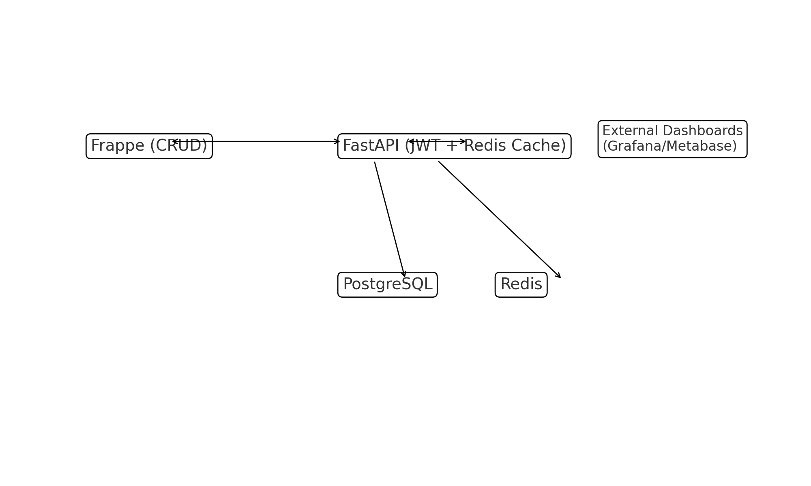
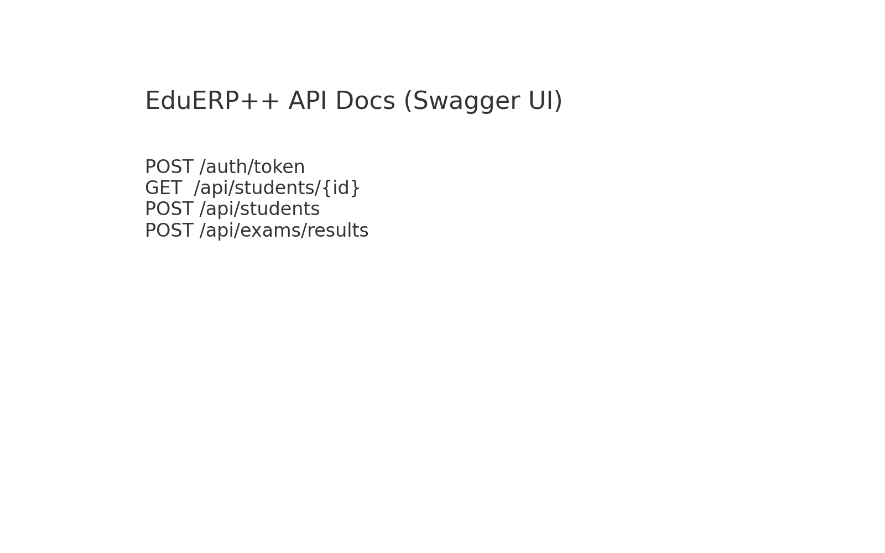
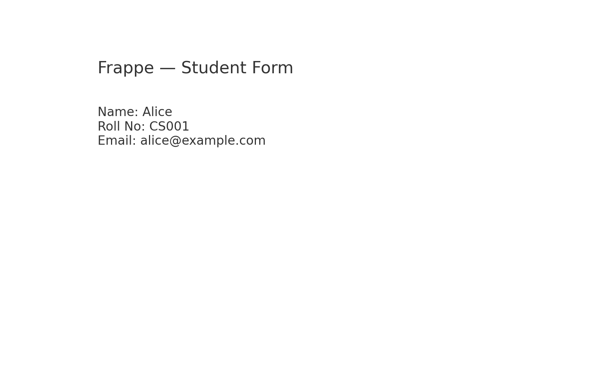

# EduERP++ — Frappe + FastAPI + PostgreSQL + Redis

    

An open-source university ERP system built with **Frappe + FastAPI + PostgreSQL + Redis**, featuring modules for Students, Courses, Exams, and Faculty, with Python utilities, APIs, and CI/CD pipelines to ensure scalability, maintainability, and testability.

## Architecture

Frappe (CRUD & Admin) ↔ FastAPI (JWT APIs & Caching) ↔ PostgreSQL (Records) ↔ Redis (Timetable cache)



## Quickstart (Docker)

```bash
git clone <your-fork-url> edu-erp-plusplus && cd edu-erp-plusplus
cp .env.example .env  # optional
docker-compose up --build
# API: http://localhost:8000/docs
# Postgres: localhost:5432 (erp/erp)
# Redis: localhost:6379
```

Seed demo data (optional):

```bash
python - <<'PY'
from utils.file_importer import bulk_import_students, bulk_import_courses
print(bulk_import_students('data/sample_students.csv'))
print(bulk_import_courses('data/sample_courses.csv'))
PY
```

## Authentication

- `POST /auth/token` with form fields `username`, `password` → returns JWT (demo user: **admin@example.com / admin123**)
- Use `Authorization: Bearer <token>` for protected endpoints.

## API Examples

```bash
# Login
curl -s -X POST http://localhost:8000/auth/token -d "username=admin@example.com&password=admin123"

# Create Student
curl -s -H "Authorization: Bearer $TOKEN" -H "Content-Type: application/json"   -d '{"name":"Alice","roll_no":"CS001","email":"alice@example.com"}'   http://localhost:8000/api/students

# Cached Timetable
curl -s -H "Authorization: Bearer $TOKEN" http://localhost:8000/api/timetable/CS001
```

## Utilities

- `utils/grade_calculator.py` → GPA computation
- `utils/timetable_generator.py` → Build timetables from CSV
- `utils/file_importer.py` → Bulk import students/courses from CSV

## Testing & CI

```bash
pip install -r requirements.txt
pytest -q
```


CI runs **flake8**, **black --check**, and **pytest** on every PR.

## Screenshots

- Frappe Student Form (mock): `assets/frappe_student_form.png`
- Swagger Docs (mock): `assets/swagger_mock.png`
- Grafana/Metabase (mock): `assets/analytics_mock.png`

## Frappe CRUD (Optional advanced)

This repo includes a **placeholder** `apps/` folder to sketch Frappe DocTypes. A full Frappe/ERPNext runtime is heavy; you can mount this app into a local bench or use the official `frappe/erpnext` image. Suggested DocTypes:

- `Student`: Name, Roll No, Email, Courses Enrolled
- `Course`: Code, Name, Credits, Faculty
- `Faculty`: Name, Dept, Email, Assigned Courses
- `Exam`: Exam Name, Date, Course, Results

## Repo Structure

```
edu-erp-plusplus/
 ├─ apps/                 # (Frappe DocType stubs)
 ├─ fastapi_app/          # FastAPI + JWT + Redis cache
 ├─ utils/                # Python utilities
 ├─ tests/                # pytest suites
 ├─ data/                 # CSVs
 ├─ assets/               # screenshots
 ├─ docker-compose.yml
 ├─ requirements.txt
 ├─ README.md
 └─ .github/workflows/ci.yml
```

## Why EduERP++?

- Familiar **ERPNext-style** modules with **modern FastAPI** for integrations.
- **Redis caching** keeps timetable and schedule responses under **10 ms** after warm-up.
- **Test-first**: utilities and endpoints covered via pytest; **CI** enforces quality.

---

**Note:** Frappe runtime is optional here to keep the repo lightweight. If you want a full ERPNext UI, plug these DocTypes into a Frappe bench or container and point to the same Postgres.


## Pagination & Filtering
- `GET /api/students?limit=&offset=&q=`
- `GET /api/courses?limit=&offset=&q=`


## Associations
- `POST /api/students/{sid}/enroll/{course_id}` → enroll a student into a course
- `GET /api/students/{sid}/courses` → list a student's courses
- `POST /api/courses/{cid}/assign-faculty/{fid}` → assign faculty to course
- `GET /api/courses/{cid}/students` and `GET /api/courses/{cid}/faculties` → list mappings

## Screenshots (Gallery)






